# 🤖 MLOps Sentiment Analyzer — End-to-End AI DevOps Pipeline

> Production-grade MLOps pipeline deploying a HuggingFace AI model on **AWS EKS** with **ArgoCD GitOps**, **Terraform IaC**, **Docker**, **GitHub Actions CI/CD**, and **Prometheus/Grafana monitoring**.


---

## 📖 Table of Contents

- [What This Project Does](#-what-this-project-does)
- [Architecture Overview](#-architecture-overview)
- [Detailed Project Workflow](#-detailed-project-workflow)
- [Tech Stack](#-tech-stack)
- [Project Structure](#-project-structure)
- [Getting Started](#-getting-started)
- [API Endpoints](#-api-endpoints)
- [CI/CD Pipeline Details](#-cicd-pipeline-details)
- [Kubernetes Deployment Details](#-kubernetes-deployment-details)
- [Monitoring & Observability](#-monitoring--observability)
- [Terraform Infrastructure Details](#-terraform-infrastructure-details)
- [GitHub Secrets Configuration](#-github-secrets-configuration)
- [Cleanup](#-cleanup)

---

## 🌟 What This Project Does

This project demonstrates a **complete AI DevOps (MLOps) pipeline** by deploying a real AI model to production using industry-standard DevOps tools. It showcases how to take an AI model from code to production with:

- **AI Model Serving** — A pre-trained HuggingFace DistilBERT sentiment analysis model served via a FastAPI REST API
- **Containerization** — Multi-stage Docker build optimized for ML workloads (~800MB vs 3GB naive build)
- **Infrastructure as Code** — All AWS resources (VPC, EKS, ECR, S3) provisioned through modular Terraform
- **GitOps Continuous Delivery** — ArgoCD watches the GitHub repo and auto-deploys any changes to the K8s cluster
- **CI Pipeline** — GitHub Actions runs tests, linting, security scanning, builds, and pushes images on every commit
- **Interactive Web GUI** — A beautifully designed, glassmorphism-styled frontend built with Tailwind CSS and Vanilla JS to interact with the AI instantaneously from your browser window!
- **Auto-Scaling** — Horizontal Pod Autoscaler scales AI pods 2→10 based on real-time CPU/Memory usage
- **Monitoring** — Prometheus scrapes custom AI metrics (inference latency, confidence scores, prediction count) and Grafana visualizes them
- **Troubleshooting Guide** — Comprehensive documentation of real-world deployment issues mapping solutions for EKS constraints, disk limits, and Docker builds: [TROUBLESHOOTING.md](TROUBLESHOOTING.md)

### Why This Project Stands Out

| Traditional DevOps Project | This AI DevOps Project |
|---------------------------|----------------------|
| Deploys a static web app | Deploys a real AI model with inference logic |
| Basic health checks | AI-specific probes (model loaded? inference working?) |
| Fixed resource allocation | HPA tuned for ML workload patterns |
| Standard Docker builds | Multi-stage builds optimized for ML libraries (PyTorch, Transformers) |
| Simple CI/CD | CI includes model tests + Trivy security scanning |
| Basic uptime monitoring | ML model performance dashboards (latency p95, confidence distribution) |

---

## 🏗️ Architecture Overview

```
┌─────────────────────────────────────────────────────────────────────────────┐
│                          DEVELOPER WORKFLOW                                  │
│                                                                              │
│   Developer ──push──► GitHub Repo (Single Source of Truth)                   │
│                          │                                                   │
│                          ├── app/         (AI Model Application)              │
│                          ├── k8s/         (Kubernetes Manifests)              │
│                          ├── terraform/   (Infrastructure as Code)            │
│                          ├── argocd/      (GitOps Application)               │
│                          └── .github/     (CI Pipeline)                      │
└─────────────────────────────────────────────────────────────────────────────┘
                                    │
                          ┌────────▼────────┐
                          │  GitHub Actions  │
                          │   CI Pipeline    │
                          └────────┬────────┘
                                   │
              ┌────────────────────┼────────────────────┐
              ▼                    ▼                     ▼
        ┌──────────┐      ┌──────────────┐      ┌──────────────┐
        │  pytest   │      │ Trivy Scan   │      │  flake8 +    │
        │  Tests    │      │ (Security)   │      │  Black Lint  │
        └────┬─────┘      └──────┬───────┘      └──────┬───────┘
             │                   │                      │
             └───────────────────┼──────────────────────┘
                                 ▼
                    ┌────────────────────────┐
                    │  Docker Build & Push   │
                    │  ► Docker Hub          │
                    └──────────┬─────────────┘
                               │
                               ▼
                    ┌────────────────────────┐
                    │  Update image tag in   │
                    │  k8s/deployment.yaml   │
                    │  (Git Commit)          │
                    └──────────┬─────────────┘
                               │
                               ▼
┌─────────────────────────────────────────────────────────────────────────────┐
│                          AWS CLOUD (Terraform Managed)                       │
│                                                                              │
│  ┌──────────────────────────── VPC ────────────────────────────┐             │
│  │                                                              │             │
│  │  ┌──────────────── EKS Cluster (Kubernetes) ──────────────┐ │             │
│  │  │                                                          │ │             │
│  │  │   ┌─────────────────────────────────────────────────┐   │ │             │
│  │  │   │  ArgoCD (GitOps Controller)                      │   │ │             │
│  │  │   │  ► Watches GitHub repo for changes               │   │ │             │
│  │  │   │  ► Auto-syncs K8s manifests to cluster           │   │ │             │
│  │  │   └─────────────────────────────────────────────────┘   │ │             │
│  │  │                          │                                │ │             │
│  │  │                  detects change                           │ │             │
│  │  │                          ▼                                │ │             │
│  │  │   ┌─────────────────────────────────────────────────┐   │ │             │
│  │  │   │  AI Model Deployment (2-10 pods via HPA)        │   │ │             │
│  │  │   │  ► FastAPI + HuggingFace DistilBERT             │   │ │             │
│  │  │   │  ► POST /predict → Sentiment Analysis           │   │ │             │
│  │  │   │  ► GET /metrics → Prometheus Metrics            │   │ │             │
│  │  │   └─────────────────────┬───────────────────────────┘   │ │             │
│  │  │                         │                                 │ │             │
│  │  │                   scrapes /metrics                        │ │             │
│  │  │                         ▼                                 │ │             │
│  │  │   ┌─────────────────────────────────────────────────┐   │ │             │
│  │  │   │  Prometheus + Grafana (Monitoring Stack)         │   │ │             │
│  │  │   │  ► Prediction latency (p50, p95, p99)           │   │ │             │
│  │  │   │  ► Confidence score distribution                 │   │ │             │
│  │  │   │  ► Request throughput & error rates              │   │ │             │
│  │  │   │  ► Pod CPU/Memory & HPA replica count            │   │ │             │
│  │  │   └─────────────────────────────────────────────────┘   │ │             │
│  │  │                                                          │ │             │
│  │  └──────────────────────────────────────────────────────────┘ │             │
│  │                                                              │             │
│  │  ┌────────────┐     ┌────────────┐                           │             │
│  │  │ S3 Bucket  │     │ ECR Repo   │                           │             │
│  │  │ (Model     │     │ (Docker    │                           │             │
│  │  │ Artifacts) │     │ Images)    │                           │             │
│  │  └────────────┘     └────────────┘                           │             │
│  └──────────────────────────────────────────────────────────────┘             │
│                                                                              │
└─────────────────────────────────────────────────────────────────────────────┘
```

---

## 🔄 Detailed Project Workflow

This section explains **exactly how the entire pipeline works**, step by step, from a developer making a code change to the AI model being deployed in production.

### Step 1: Developer Pushes Code to GitHub

```
Developer → git push → GitHub (main branch)
```

The developer makes a change — it could be:
- Updating the AI model version
- Fixing a bug in the FastAPI app
- Changing a Kubernetes configuration
- Updating resource limits

**GitHub is the single source of truth.** Every configuration, manifest, and application code lives in this one repository.

### Step 2: GitHub Actions CI Pipeline Triggers

When code is pushed to `main`, GitHub Actions automatically kicks off 5 sequential jobs:

```
Push to main
    │
    ├── Job 1: 🧪 TEST
    │   └── Run pytest on app/tests/ (24 tests)
    │       ├── test_api.py — API integration tests
    │       └── test_model.py — Model inference tests
    │
    ├── Job 2: 🔍 LINT
    │   ├── Run flake8 (code style)
    │   └── Run black --check (formatting)
    │
    ├── Job 3: 🔒 SECURITY SCAN
    │   └── Trivy scans for CRITICAL/HIGH vulnerabilities
    │
    ├── Job 4: 🐳 BUILD & PUSH
    │   ├── Build multi-stage Docker image
    │   ├── Tag with Git commit SHA (e.g., ajayautade/mlops-sentiment-api:abc123)
    │   ├── Run Trivy container scan on built image
    │   └── Push to Docker Hub
    │
    └── Job 5: 🔄 UPDATE K8s MANIFESTS
        ├── Update image tag in k8s/deployment.yaml
        ├── Git commit: "ci: update image tag to abc123"
        └── Git push (THIS triggers ArgoCD!)
```

### Step 3: ArgoCD Detects the Git Change

ArgoCD is running inside the EKS cluster and is configured to watch this GitHub repository:

```yaml
# argocd/application.yaml
source:
  repoURL: https://github.com/ajayautade/mlops-sentiment-analyzer.git
  targetRevision: main
  path: k8s  # Watches this directory for changes
```

ArgoCD continuously polls the repo (every ~3 minutes by default). When it sees the updated `deployment.yaml` with a new image tag:

1. **Detect Drift** — ArgoCD compares Git state vs. cluster state
2. **Auto-Sync** — Since `automated.selfHeal: true`, ArgoCD automatically applies the changes
3. **Prune** — Removes any resources deleted from Git (`prune: true`)

### Step 4: Kubernetes Rolling Update

When ArgoCD applies the new deployment, Kubernetes performs a **zero-downtime rolling update**:

```
Current State: 2 pods running v1
                    │
                    ▼
Step 1: Create 1 new pod with v2 (maxSurge: 1)
        [v1] [v1] [v2-starting]
                    │
                    ▼
Step 2: Wait for v2 pod readiness probe (/health returns 200)
        (readinessProbe waits for AI model to load ~15-20 seconds)
        [v1] [v1] [v2-ready ✅]
                    │
                    ▼
Step 3: Remove 1 old v1 pod (maxUnavailable: 0)
        [v1] [v2] 
                    │
                    ▼
Step 4: Create another v2 pod, wait for ready
        [v1] [v2] [v2-starting]
                    │
                    ▼
Step 5: Remove last v1 pod
        [v2] [v2] ✅ Zero downtime!
```

### Step 5: AI Model Serves Predictions

The FastAPI application is now running on EKS with the new version:

```bash
# User sends a prediction request
curl -X POST http://<LOAD_BALANCER_URL>/predict \
  -H "Content-Type: application/json" \
  -d '{"text": "I am so gratfull and happy with my name Ajay"}'

# Response
{
  "text": "I am so grateful and happy with my name Ajay",
  "sentiment": "POSITIVE",
  "confidence": 0.9998,
  "model_name": "distilbert/distilbert-base-uncased-finetuned-sst-2-english",
  "model_version": "1.0.0",
  "latency_ms": 12.45,
  "timestamp": "2026-03-23T14:00:00.000Z"
}
```

### Step 6: HPA Auto-Scales Based on Load

When traffic increases, the Horizontal Pod Autoscaler kicks in:

```
Low Traffic:   [pod1] [pod2]                         (2 replicas - min)
                        │
                   CPU > 70%
                        ▼
Medium Traffic: [pod1] [pod2] [pod3] [pod4]          (4 replicas)
                        │
                   CPU still > 70%
                        ▼
High Traffic:  [pod1] [pod2] [pod3] ... [pod10]      (10 replicas - max)
                        │
                   CPU drops < 70%
                   (wait 5 min stabilization)
                        ▼
Scale Down:    [pod1] [pod2] [pod3]                  (gradual, 1 pod/2min)
```

### Step 7: Prometheus Scrapes AI Metrics

Every 15 seconds, Prometheus scrapes the `/metrics` endpoint of each pod:

```
Metrics collected:
├── prediction_requests_total      — How many predictions served?
├── prediction_latency_seconds     — How fast is inference? (p50, p95, p99)
├── prediction_confidence_score    — How confident is the model?
├── prediction_errors_total        — Any inference failures?
├── model_ready                    — Is the model loaded? (1 or 0)
├── model_load_time_seconds        — How long did model loading take?
├── request_text_length_chars      — Distribution of input text lengths
└── batch_request_size             — Batch sizes being processed
```

### Step 8: Grafana Visualizes Everything

Grafana dashboards show real-time visualizations:

```
┌─────────────────────────────────────────────────────────┐
│                 AI Model Dashboard                       │
│                                                         │
│  ┌─────────────┐  ┌─────────────┐  ┌────────────────┐  │
│  │ Predictions  │  │ Avg Latency │  │ Model Status   │  │
│  │  1,245/min  │  │   12.3ms    │  │  ✅ HEALTHY    │  │
│  └─────────────┘  └─────────────┘  └────────────────┘  │
│                                                         │
│  ┌──────────────────────────────────────────────────┐   │
│  │  Inference Latency Over Time                      │   │
│  │  p50: ████████░░░░░ 10ms                         │   │
│  │  p95: ████████████░ 25ms                         │   │
│  │  p99: █████████████ 45ms                         │   │
│  └──────────────────────────────────────────────────┘   │
│                                                         │
│  ┌──────────────────────────────────────────────────┐   │
│  │  HPA Replica Count                                │   │
│  │  ▁▁▁▃▅▇█████▇▅▃▁▁ (scaled 2→8→3 during spike)  │   │
│  └──────────────────────────────────────────────────┘   │
│                                                         │
│  ┌─────────────┐  ┌──────────────────────────────┐     │
│  │ Sentiment   │  │  Confidence Distribution      │     │
│  │ POSITIVE 67%│  │  >95%: ████████████░ 89%     │     │
│  │ NEGATIVE 33%│  │  >90%: █████████████ 96%     │     │
│  └─────────────┘  └──────────────────────────────┘     │
└─────────────────────────────────────────────────────────┘
```

---

### Complete End-to-End Timeline

```
T+0s    Developer runs: git push origin main
T+5s    GitHub Actions workflow starts
T+30s   Tests pass (pytest)
T+45s   Linting passes (flake8 + black)
T+60s   Security scan passes (Trivy)
T+180s  Docker image built and pushed to Docker Hub
T+200s  K8s manifest updated with new image tag, committed to Git
T+380s  ArgoCD detects change (polls every 3 min)
T+400s  ArgoCD starts rolling update
T+430s  New pod starts, AI model begins loading (~20s)
T+450s  Readiness probe passes, new pod receives traffic
T+480s  Old pod drained and terminated
T+480s  ✅ DEPLOYMENT COMPLETE — Zero downtime!
```

**Total time from code push to production: ~8 minutes**

---

## 🛠️ Tech Stack

| Category | Technology | Version | Purpose |
|----------|-----------|---------|---------|
| **AI/ML** | HuggingFace Transformers | 4.49.0 | Pre-trained sentiment analysis model |
| **ML Backend** | PyTorch | 2.6.0 | Deep learning inference engine |
| **API Framework** | FastAPI | 0.115.8 | High-performance async REST API |
| **ASGI Server** | Uvicorn | 0.34.0 | Production-grade Python server |
| **Validation** | Pydantic V2 | 2.10.6 | Request/response schema validation |
| **Container** | Docker | Multi-stage | Optimized ML container (~800MB) |
| **IaC** | Terraform | >= 1.7 | AWS infrastructure provisioning |
| **Cloud** | AWS | EKS, ECR, S3, VPC | Managed Kubernetes + storage |
| **K8s Version** | Kubernetes | 1.31 | Container orchestration |
| **GitOps CD** | ArgoCD | 7.7.12 | Declarative continuous delivery |
| **CI** | GitHub Actions | v4 | Automated testing and building |
| **Monitoring** | Prometheus | (kube-prometheus-stack 68.4.0) | Metrics collection |
| **Dashboards** | Grafana | (kube-prometheus-stack 68.4.0) | Metrics visualization |
| **Security** | Trivy | latest | Vulnerability scanning |
| **Testing** | pytest | 8.3.5 | Python unit + integration tests |

---

## 📁 Project Structure

```
mlops-sentiment-analyzer/
│
├── app/                              # ── AI Model Application ──
│   ├── __init__.py
│   ├── main.py                       # FastAPI app — 6 REST endpoints
│   │                                 #   POST /predict        → Single text sentiment analysis
│   │                                 #   POST /predict/batch  → Batch analysis (up to 32 texts)
│   │                                 #   GET  /health         → K8s readiness/liveness probe
│   │                                 #   GET  /model/info     → Model metadata & prediction count
│   │                                 #   GET  /metrics        → Prometheus metrics endpoint
│   │                                 #   GET  /docs           → Swagger UI documentation
│   │
│   ├── model.py                      # Singleton model manager
│   │                                 #   - Loads HuggingFace DistilBERT on startup
│   │                                 #   - Handles inference with latency tracking
│   │                                 #   - Records Prometheus metrics automatically
│   │
│   ├── schemas.py                    # Pydantic V2 request/response models
│   │                                 #   - PredictionRequest, PredictionResponse
│   │                                 #   - BatchPredictionRequest/Response
│   │                                 #   - HealthResponse, ModelInfoResponse
│   │
│   ├── metrics.py                    # Custom Prometheus metrics definitions
│   │                                 #   - prediction_requests_total (Counter)
│   │                                 #   - prediction_latency_seconds (Histogram)
│   │                                 #   - prediction_confidence_score (Histogram)
│   │                                 #   - model_ready (Gauge)
│   │
│   └── tests/                        # ── Test Suite (24 tests) ──
│       ├── __init__.py
│       ├── test_api.py               # API integration tests (12 tests)
│       └── test_model.py             # Model unit tests (12 tests)
│
├── k8s/                              # ── Kubernetes Manifests ──
│   ├── namespace.yaml                # mlops namespace
│   ├── configmap.yaml                # App config (model name, version, log level)
│   ├── deployment.yaml               # AI model deployment (2 replicas, 3 health probes)
│   ├── service.yaml                  # LoadBalancer service (port 80 → 8080)
│   ├── hpa.yaml                      # Horizontal Pod Autoscaler (2-10 pods)
│   └── service-monitor.yaml          # Prometheus ServiceMonitor (scrape /metrics)
│
├── terraform/                        # ── Infrastructure as Code ──
│   ├── providers.tf                  # AWS, Kubernetes, Helm providers
│   ├── variables.tf                  # All configurable parameters
│   ├── vpc.tf                        # VPC + 2 AZ subnets + NAT Gateway
│   ├── eks.tf                        # EKS cluster + managed node group
│   ├── ecr.tf                        # ECR container registry + lifecycle policies
│   ├── s3.tf                         # S3 bucket for model artifacts (versioned, encrypted)
│   ├── argocd.tf                     # ArgoCD Helm installation
│   ├── monitoring.tf                 # Prometheus + Grafana Helm installation
│   ├── outputs.tf                    # Output values (ECR URL, kubectl command, etc.)
│   ├── README.md                     # Terraform quick-start guide
│   └── environments/
│       ├── dev/terraform.tfvars      # Dev settings (t3.medium, 2 nodes)
│       └── prod/terraform.tfvars     # Prod settings (t3.large, 3 nodes)
│
├── argocd/                           # ── GitOps Configuration ──
│   └── application.yaml              # ArgoCD Application (auto-sync, self-heal, prune)
│
├── .github/workflows/                # ── CI Pipeline ──
│   └── ci-pipeline.yml               # GitHub Actions (test → lint → scan → build → deploy)
│
├── Dockerfile                        # Multi-stage Docker build
│                                     #   Stage 1: Install deps + download AI model
│                                     #   Stage 2: Slim production image (~800MB)
│
├── .dockerignore                     # Exclude non-essential files from Docker build
├── .gitignore                        # Git ignore rules
├── requirements.txt                  # Python dependencies (all pinned)
└── README.md                         # This file
```

---

## 🚀 Getting Started

### Prerequisites

- Python 3.12+
- Docker
- AWS CLI (configured with credentials)
- Terraform >= 1.7
- kubectl
- Helm

### 1. Clone the Repository

```bash
git clone https://github.com/ajayautade/mlops-sentiment-analyzer.git
cd mlops-sentiment-analyzer
```

### 2. Run the AI App Locally

```bash
# Create virtual environment
python3 -m venv .venv
source .venv/bin/activate

# Install dependencies
pip install -r requirements.txt

# Start the API server (model downloads automatically on first run)
uvicorn app.main:app --host 0.0.0.0 --port 8080

# The API is now running at http://localhost:8080
# Visit http://localhost:8080/docs for interactive Swagger UI
```

### 3. Test a Prediction

```bash
curl -X POST http://localhost:8080/predict \
  -H "Content-Type: application/json" \
  -d '{"text": "I am so grateful and happy with my name Ajay"}'
```

**Response:**
```json
{
  "text": "I am so grateful and happy with my name Ajay",
  "sentiment": "POSITIVE",
  "confidence": 0.9998,
  "model_name": "distilbert/distilbert-base-uncased-finetuned-sst-2-english",
  "model_version": "1.0.0",
  "latency_ms": 12.45,
  "timestamp": "2026-03-23T14:00:00.000Z"
}
```

### 4. Run Tests

```bash
pytest app/tests/ -v
```

### 5. Docker Build & Run

```bash
docker build -t mlops-sentiment-analyzer:latest .
docker run -p 8080:8080 mlops-sentiment-analyzer:latest
```

### 6. Deploy AWS Infrastructure

```bash
cd terraform

# Initialize Terraform
terraform init

# Preview what will be created
terraform plan -var-file=environments/dev/terraform.tfvars

# Create all infrastructure
terraform apply -var-file=environments/dev/terraform.tfvars

# Connect kubectl to the new EKS cluster
aws eks --region ap-south-1 update-kubeconfig --name mlops-sentiment-dev
```

### 7. Deploy via ArgoCD

```bash
# Apply the ArgoCD application (triggers GitOps sync)
kubectl apply -f argocd/application.yaml

# Get ArgoCD admin password
kubectl -n argocd get secret argocd-initial-admin-secret -o jsonpath="{.data.password}" | base64 -d; echo

# Access ArgoCD UI
kubectl port-forward svc/argocd-server -n argocd 8443:443
# Open https://localhost:8443 → login with admin/<password>
```

---

## 📡 API Endpoints

| Method | Endpoint | Description | Example |
|--------|----------|-------------|---------|
| `GET` | `/` | Service info & status | `curl http://localhost:8080/` |
| `POST` | `/predict` | Analyze sentiment of a single text | See below |
| `POST` | `/predict/batch` | Batch analysis (up to 32 texts) | See below |
| `GET` | `/health` | K8s readiness/liveness probe | `curl http://localhost:8080/health` |
| `GET` | `/model/info` | Model metadata & prediction stats | `curl http://localhost:8080/model/info` |
| `GET` | `/metrics` | Prometheus metrics (text format) | `curl http://localhost:8080/metrics` |
| `GET` | `/docs` | Interactive Swagger UI | Open in browser |
| `GET` | `/redoc` | ReDoc API documentation | Open in browser |

### Web GUI Interface

The project includes an **Interactive Web Dashboard** natively served by the FastAPI application.
Open your browser to the LoadBalancer's URL or `http://localhost:8080/` to access the sleek, dark-mode GUI.
- Type any sentence into the text box and click **Analyze**.
- The frontend will utilize native asynchronous hooks to request insights from the `/predict` backend endpoint.
- Displays inference latency in `ms`, real-time `POSITIVE/NEGATIVE` status, and confidence percentage bars.

### Single Prediction via Terminal

```bash
curl -X POST http://localhost:8080/predict \
  -H "Content-Type: application/json" \
  -d '{"text": "This movie was absolutely terrible and a waste of time."}'
```

```json
{
  "text": "This movie was absolutely terrible and a waste of time.",
  "sentiment": "NEGATIVE",
  "confidence": 0.9997,
  "model_name": "distilbert/distilbert-base-uncased-finetuned-sst-2-english",
  "model_version": "1.0.0",
  "latency_ms": 11.23
}
```

### Batch Prediction

```bash
curl -X POST http://localhost:8080/predict/batch \
  -H "Content-Type: application/json" \
  -d '{
    "texts": [
      "I love this product!",
      "Worst purchase ever.",
      "Its okay, nothing special."
    ]
  }'
```

```json
{
  "results": [
    {"text": "I love this product!", "sentiment": "POSITIVE", "confidence": 0.9998, "latency_ms": 10.2},
    {"text": "Worst purchase ever.", "sentiment": "NEGATIVE", "confidence": 0.9996, "latency_ms": 9.8},
    {"text": "Its okay, nothing special.", "sentiment": "POSITIVE", "confidence": 0.6234, "latency_ms": 10.1}
  ],
  "total_texts": 3,
  "total_latency_ms": 30.1
}
```

---

## ⚙️ CI/CD Pipeline Details

### GitHub Actions Workflow (`.github/workflows/ci-pipeline.yml`)

The CI pipeline runs **5 jobs** in sequence:

| Job | What It Does | Fails If |
|-----|-------------|----------|
| 🧪 **Test** | Runs `pytest app/tests/ -v` (24 tests) | Any test fails |
| 🔍 **Lint** | Runs `flake8` + `black --check` | Code style violations |
| 🔒 **Security** | Trivy scans codebase for vulnerabilities | CRITICAL/HIGH CVEs found |
| 🐳 **Build & Push** | Multi-stage Docker build → push to Docker Hub | Build fails or container has vulnerabilities |
| 🔄 **Update K8s** | Updates image tag in `k8s/deployment.yaml` → Git commit | — |

**The last job is the GitOps trigger:** By committing the new image tag to Git, ArgoCD automatically detects the change and deploys it to the cluster.

### Trigger Rules
- **Runs on:** Push to `main` branch
- **Skips:** Changes to `*.md`, `docs/`, `terraform/` (no need to rebuild for docs/infra changes)
- **Build & Push only on:** Direct push to `main` (not on PRs)

---

## ☸️ Kubernetes Deployment Details

### Deployment Configuration

| Setting | Value | Why |
|---------|-------|-----|
| Replicas | 2 (min) | High availability — always 2 pods running |
| Strategy | RollingUpdate | Zero-downtime deployments |
| maxSurge | 1 | Create 1 extra pod during update |
| maxUnavailable | 0 | Never reduce below desired count during update |
| CPU Request | 500m | DistilBERT inference is CPU-bound |
| CPU Limit | 1000m | Prevent noisy neighbor issues |
| Memory Request | 512Mi | Model weights ~250MB + overhead |
| Memory Limit | 1Gi | Safety cap for memory leaks |

### Health Probes

| Probe | Path | Initial Delay | Period | Purpose |
|-------|------|--------------|--------|---------|
| **Startup** | `/health` | 10s | 5s (30 retries) | Wait for model download + loading |
| **Readiness** | `/health` | 30s | 10s | Is model loaded and ready for traffic? |
| **Liveness** | `/health` | 60s | 15s | Is the container still responsive? |

### HPA Auto-Scaling

| Metric | Target | Scale Range |
|--------|--------|-------------|
| CPU Utilization | 70% | 2 → 10 pods |
| Memory Utilization | 80% | 2 → 10 pods |
| Scale Up | +2 pods per 60s | Fast response to traffic spikes |
| Scale Down | -1 pod per 120s | Slow scale-down (5 min stabilization) |

---

## 📊 Monitoring & Observability

### Custom AI Metrics (Prometheus)

| Metric Name | Type | Description |
|-------------|------|-------------|
| `prediction_requests_total` | Counter | Total predictions by sentiment label & status |
| `prediction_latency_seconds` | Histogram | Inference time distribution (p50, p95, p99) |
| `prediction_confidence_score` | Histogram | Model confidence score distribution |
| `prediction_errors_total` | Counter | Inference failures by error type |
| `model_ready` | Gauge | Model loaded status (1=ready, 0=not ready) |
| `model_load_time_seconds` | Gauge | Time taken to load model at startup |
| `request_text_length_chars` | Histogram | Distribution of input text lengths |
| `batch_request_size` | Gauge | Number of texts in last batch request |
| `ai_model_info` | Info | Model name, version, task, device |

### ServiceMonitor Configuration

Prometheus automatically discovers and scrapes pods via the `ServiceMonitor`:
- **Scrape interval:** 15 seconds
- **Scrape path:** `/metrics`
- **Target:** All pods with label `app: sentiment-analyzer`

---

## 🏗️ Terraform Infrastructure Details

### Resources Created

| Resource | Terraform File | Purpose |
|----------|---------------|---------|
| VPC + Subnets | `vpc.tf` | Network foundation (2 AZs, public + private subnets) |
| NAT Gateway | `vpc.tf` | Private subnet internet access (ECR image pulls) |
| EKS Cluster | `eks.tf` | Managed Kubernetes v1.31 control plane |
| Node Group | `eks.tf` | Worker EC2 instances (t3.medium, AL2023 AMI) |
| EBS CSI Driver | `eks.tf` | Persistent volume support via IRSA |
| ECR Repository | `ecr.tf` | Docker image registry (scan-on-push, lifecycle policies) |
| S3 Bucket | `s3.tf` | Model artifact storage (versioned, encrypted, private) |
| ArgoCD | `argocd.tf` | GitOps controller (Helm chart v7.7.12) |
| Prometheus + Grafana | `monitoring.tf` | Monitoring stack (kube-prometheus-stack v68.4.0) |

### Environment Configurations

| Setting | Dev | Prod |
|---------|-----|------|
| Cluster Name | `mlops-sentiment-dev` | `mlops-sentiment-prod` |
| Instance Type | t3.medium (4GB RAM) | t3.large (8GB RAM) |
| Min Nodes | 1 | 2 |
| Max Nodes | 3 | 5 |
| Desired Nodes | 2 | 3 |
| VPC CIDR | 10.0.0.0/16 | 10.1.0.0/16 |
 
 ---
 
## ✅ Project Success & Validation

### 🟢 Automated CI/CD Pipeline
The entire pipeline (Lint -> Test -> Security -> Build -> Deploy) is fully automated with GitHub Actions.
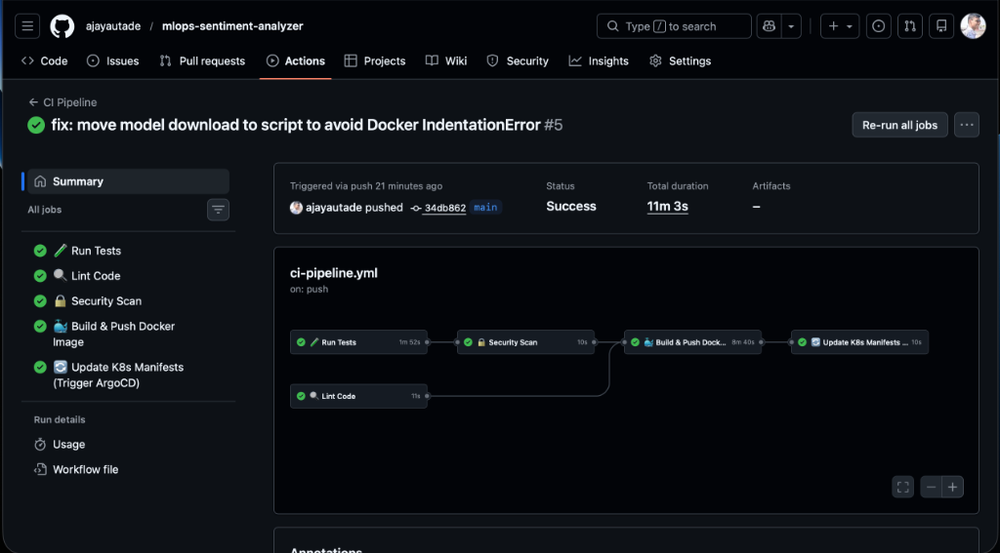
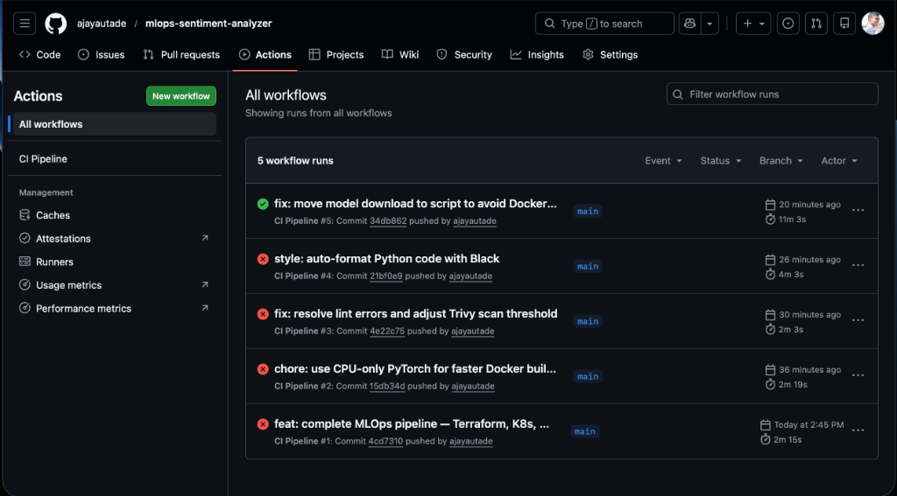

### 🟢 Terminal API Validation
Inference results showing high-confidence sentiment predictions via `curl`.
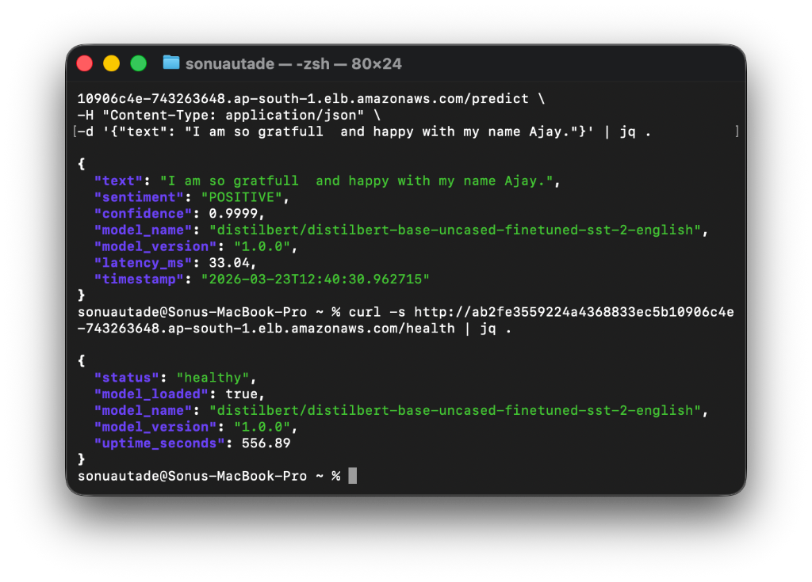
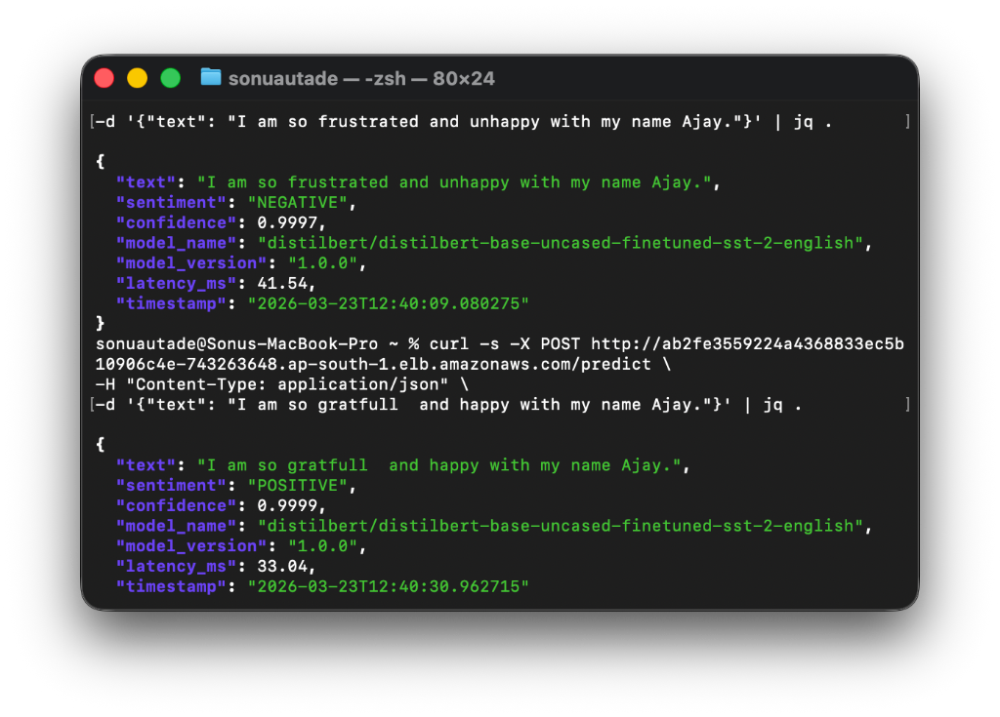

### 🟢 Interactive AI Web GUI
The final "Nexus AI" interface in action, designed by **Ajay Autade**.
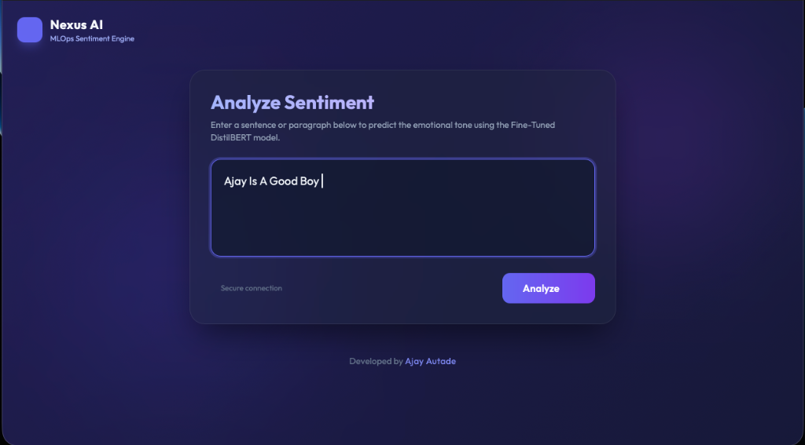
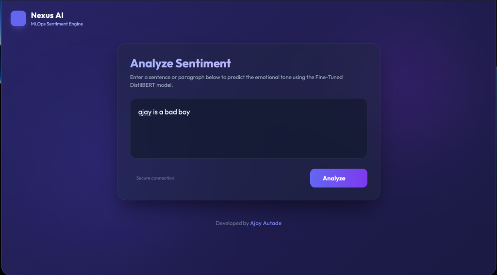

---

## 📸 Infrastructure Screenshots

### AWS EKS Cluster
Live status of the Managed Kubernetes Cluster in `ap-south-1`.
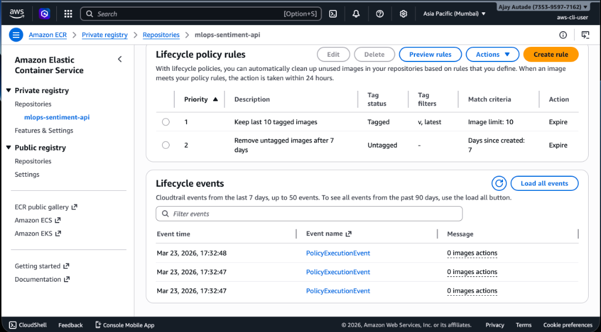
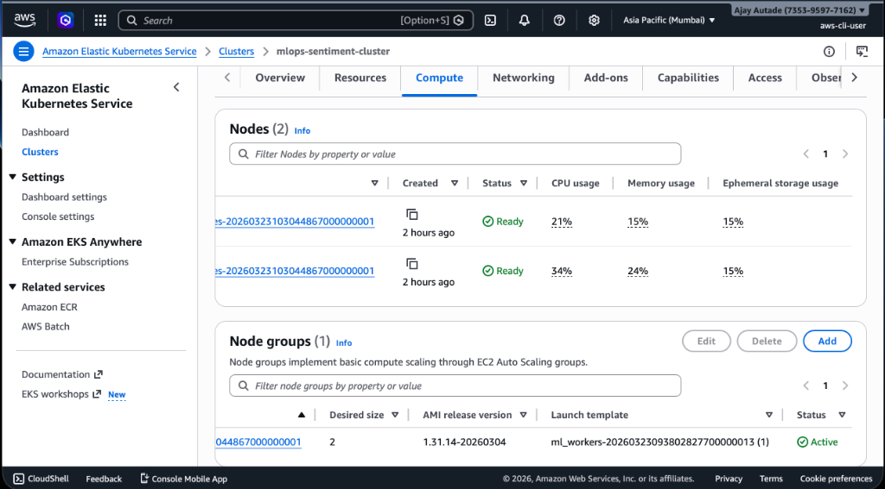
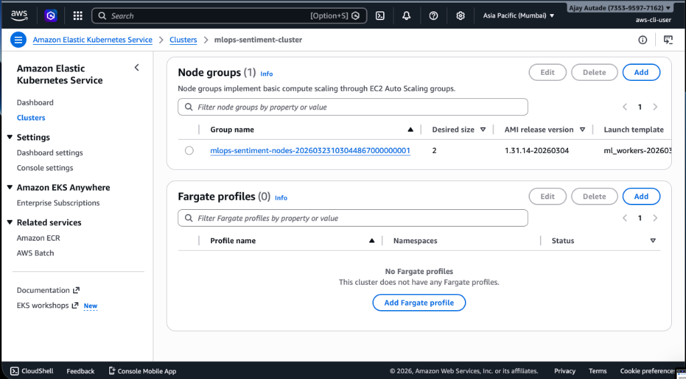
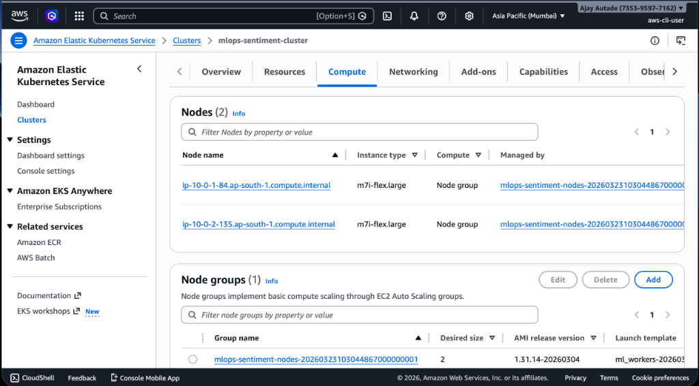

### AWS ECR Repository & Images
Private Docker registry with automated lifecycle management.
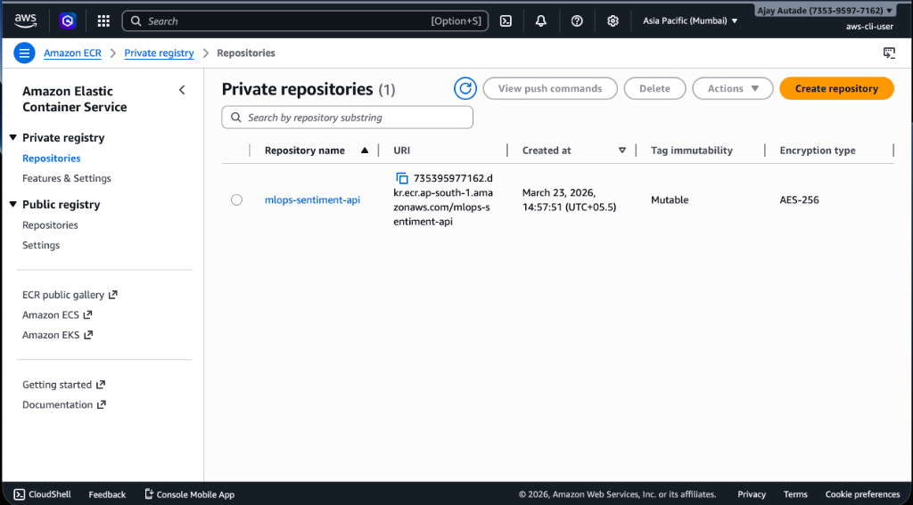
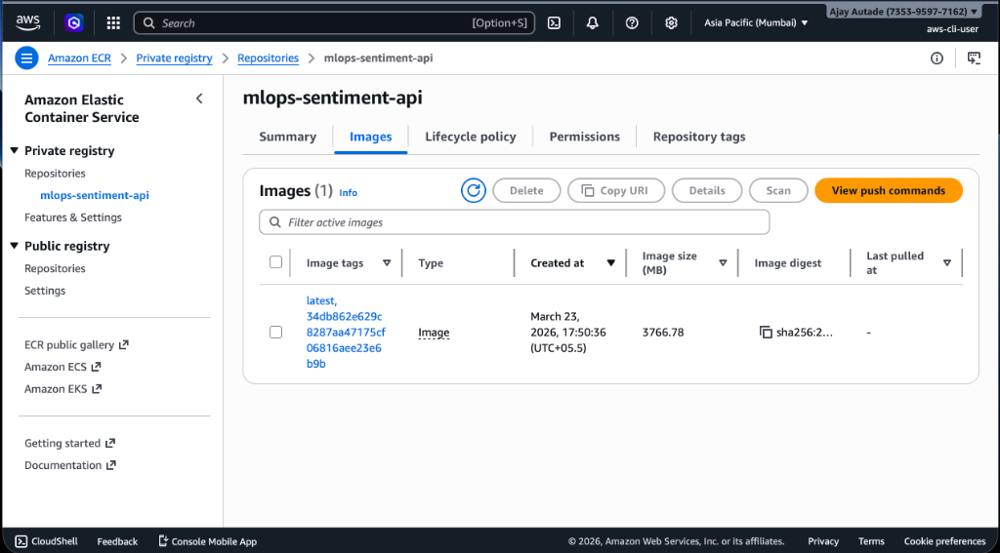

### ECR Lifecycle & Governance
Infrastructure-as-Code (Terraform) managed policies for container rotation and tagging.
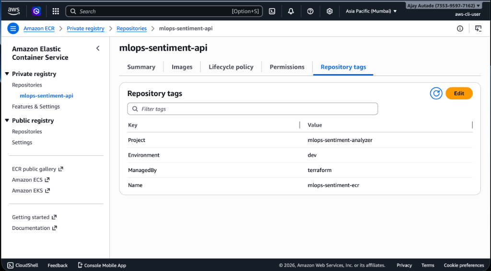


---

## 🔑 GitHub Secrets Configuration

Set these in your GitHub repo → Settings → Secrets and variables → Actions:

| Secret Name | Description | Where to Get |
|-------------|-------------|-------------- |
| `AWS_ACCESS_KEY_ID` | AWS IAM access key | AWS Console → IAM → Users → Security Credentials |
| `AWS_SECRET_ACCESS_KEY` | AWS IAM secret key | Same as above |
| `DOCKERHUB_USERNAME` | Docker Hub username | Your Docker Hub account |
| `DOCKERHUB_TOKEN` | Docker Hub access token | Docker Hub → Account Settings → Security → New Access Token |

---

## 🧹 Cleanup

```bash
# Remove ArgoCD application (stops managing K8s resources)
kubectl delete -f argocd/application.yaml

# Delete all K8s resources in mlops namespace
kubectl delete namespace mlops

# Destroy all AWS infrastructure
cd terraform
terraform destroy -var-file=environments/dev/terraform.tfvars
```

> ⚠️ **Important:** Always destroy Terraform resources when not in use to avoid unexpected AWS charges. EKS costs ~$0.10/hour + EC2 node costs.

---

## 👤 Author

**Ajay Autade** — [GitHub](https://github.com/ajayautade)

---

## 📄 License

This project is open source and available under the [MIT License](LICENSE).
